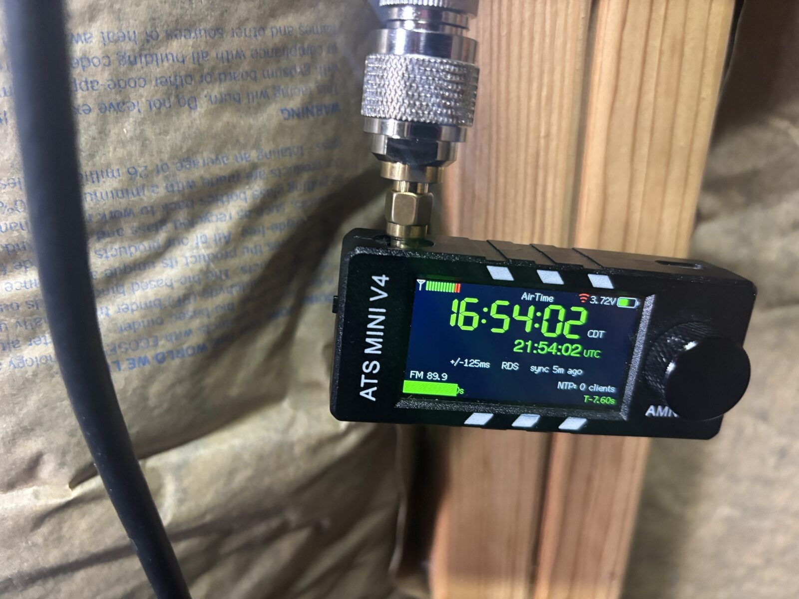
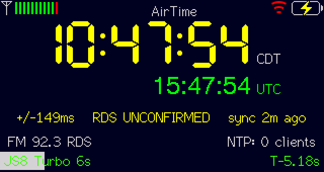
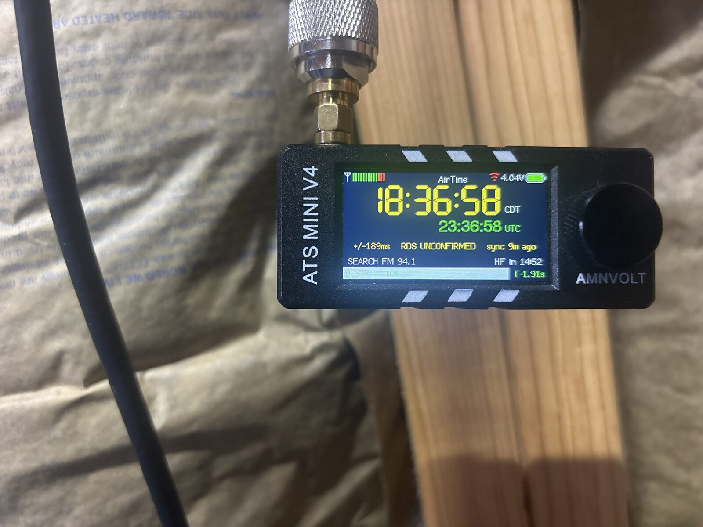
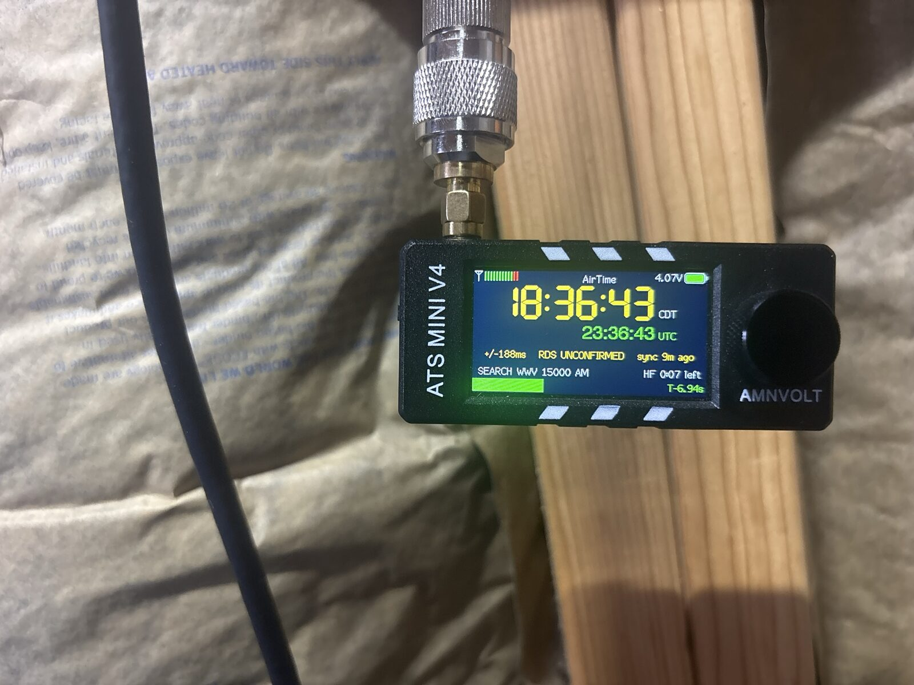
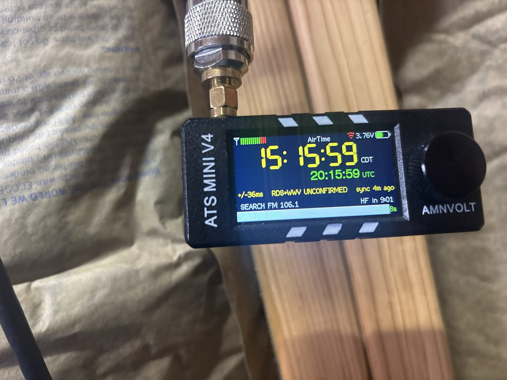
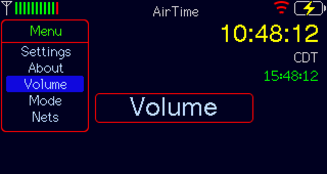
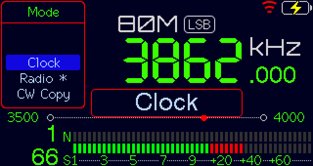
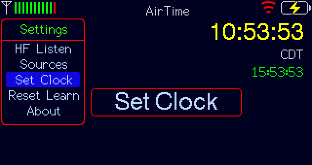
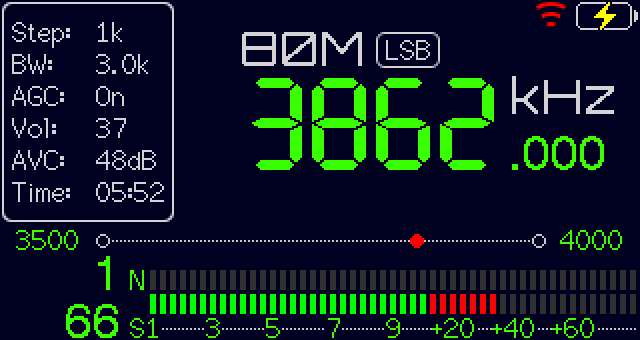

<div align="center">

# ⏱ AirTime

### Accurate time from the air, with no internet and no GPS.

**A pocket shortwave radio that finds the correct time by itself, tells you how much to trust it, and hands it to your laptop for FT8 and JS8.**

It listens to FM stations and to WWV, checks them against each other, and only calls the time **Green** when two different sources agree. It then serves that time over its own Wi‑Fi as NTP. Nothing in the loop touches the internet.

<br/>

[](lib/airtime_core)
[](#-what-you-need)
[](test)
[](https://github.com/cdburgess75/AirTime/releases/latest)
[](https://github.com/esp32-si4732/ats-mini)

<br/>



*Green means two independent sources agree. This one is on a big HF antenna in Louisiana, confirmed by two FM stations.*

</div>

---

## Why

FT8 and JS8 only work if your computer's clock is within about a second of UTC. In the field, after a storm, or anywhere without internet, there is no NTP. GPS is one more thing to carry, one more thing to fail, and it can be jammed or spoofed.

Time is already being broadcast, all day, everywhere in the country: FM stations send it in their RDS data, and WWV sends it on shortwave from Colorado. AirTime is a $60 radio that listens to both, works out which ones to believe, and serves the result to your laptop. **No soldering, no modifications**, and nothing to subscribe to.

---

## What it does

- **Finds the time on its own.** FM stations that send clock time are found by scanning the dial, wherever you are. WWV is checked on 5, 10 and 15 MHz. Nothing about your location is built in.
- **Grades every source.** Each station gets a colour: **Green** (confirmed by a different source), **Yellow** (gave a time nobody has checked), **Red** (silent, or proven wrong). A wrong station, and there are plenty, is caught and ignored.
- **Never claims more than it knows.** The screen always shows the uncertainty (±36 ms, ±400 ms…). Until two sources agree, the clock is Yellow and NTP tells your laptop not to use it yet.
- **Learns its own crystal**, so it keeps good time between checks.
- **Serves NTP** on `192.168.4.1` from its own Wi‑Fi network. Join it, sync, run FT8.
- **Phone app**, served by the radio: big clock, live FT8/JS8 cycle bar, source list, and a **Set radio clock from this phone** button for when you want it right now.
- **FT8/JS8 cycle bar** on the screen and in the app: FT8, FT4, FT2, JS8 (four speeds), JT65/JT9, WSPR. If your laptop starts transmitting when the bar hasn't rolled over, your laptop's clock is the one that's wrong.
- **It's still a radio.** Choose RADIO at power-on and you get the full ATS Mini receiver: 150 kHz–30 MHz AM/SSB, FM, a **TIME** band with all the standard time stations (WWV, WWVH, CHU, BPM, RWM, HLA, YVTO), ~8,000 embedded shortwave schedules, ham net schedules, a CW decoder and a waterfall.

---

## How it gets the time

| Source | What it gives | How it's used |
|---|---|---|
| **FM RDS clock time** | date and time, to about ±0.4 s | The fast path. Two stations that agree turn the clock Green within minutes. |
| **WWV minute tone** | the exact second, to about ±30 ms | Confirms and sharpens the FM time. Two tones that agree are needed for a big correction. |
| **WWV timecode** | full date and time from HF alone | In the firmware; still being proven on the air. |
| **Your phone** | ±1 s, anywhere | One button on the radio's web page. |
| **Set Clock by hand** | ±5 s | Settings → Set Clock, press at :00. |

**The one rule:** no single source is ever trusted on its own. A correction bigger than half a second needs two independent sources, or you. That's what stopped a local FM station that runs 3.3 seconds slow from setting this radio's clock, and it's the same defence against a spoofed signal.

**Places.** The radio records each FM station's ID code. Carry it to another town and it notices the saved frequencies have strangers on them, scans the dial again, and keeps the new place separately. Bring it home and the home stations come straight back.

**One tuner.** The radio can't listen to FM and WWV at the same time, and it can't run its Wi‑Fi while it listens to WWV (an ESP32 hardware limit). So it alternates: most of the time it sits on FM with Wi‑Fi up; a few times an hour it drops Wi‑Fi, listens for WWV for a few minutes, and comes back. The screen tells you which it's doing and when the next switch is.

---

## The screen

<div align="center">



</div>

| Line | Meaning |
|---|---|
| **Big digits** | Local time. **Green** = confirmed by two sources. **Yellow** = one source, unconfirmed. **Red** = no live source; running on the last known time. |
| **UTC** | Always shown, always green when the clock is valid. |
| **±149 ms · RDS UNCONFIRMED · sync 2m ago** | How far off it could be, which sources set it, and how long since the last fix. |
| **SEARCH FM 92.3 / SEARCH WWV 15000 AM** | What the radio is tuned to right now. |
| **HF in 14:52 / HF 0:07 left** | Until the time is Green: when the next WWV listening window starts, or how long the current one has left. |
| **JS8 Turbo 6s · T‑5.18s** | The cycle bar: the current FT8/JS8 slot filling, and a countdown to the next one. Turn the knob to change mode. |

<div align="center">



*Left: on FM, counting down to the next WWV window. Right: inside a WWV window on 15 MHz.*

<br/><br/>



*WWV has spoken: ±36 ms. It stays Yellow until a second source agrees with WWV.*

</div>

### Menus

<div align="center">



</div>

Press the knob for the menu. **Mode** switches between Clock, Radio, CW Copy and Waterfall. Under **Settings** you'll find **Sources** (every station and WWV band with its colour), **HF Listen** (start a WWV window now), **Set Clock**, **Time Zone** and **WWV Band**.

<div align="center">


*Radio mode. The dial is yours; AirTime keeps time quietly underneath and NTP keeps serving.*
</div>

---

## The phone app

Join the radio's Wi‑Fi and open **`http://192.168.4.1`**. Add it to your home screen and it opens full-screen like an app.

<div align="center">


</div>

- **Clock and cycle bar**, drawn from the *radio's* time, never the phone's.
- **Set radio clock from this phone**: one tap sets the radio to your phone's time (±1 s) when you don't want to wait for the air.
- **Clock sources**: the same Green/Yellow/Red list as on the radio, with how often each was heard and confirmed.
- **`/status`**: a plain diagnostics page with everything, including the radio's own analysis of its last WWV listening windows.

> **▶ [Try the app in your browser](https://cdburgess75.github.io/AirTime/demo/)** — the real interface, running on simulated data.

> The app needs the radio's Wi‑Fi to load, and the radio drops its Wi‑Fi during each WWV window (a few minutes, a few times an hour). The app says so when it happens and comes back by itself.

---

## Get it going

### What you need

- An **ATS Mini V4** (also sold as AMNVOLT ATS Mini): ESP32‑S3 + SI4732, 320×170 screen, USB‑C. Around $60. **No modifications**: V4a/V4b boards already route the audio the WWV detector listens to. *(Original V4 boards need one jumper wire; see [`docs/PLAN.md`](docs/PLAN.md).)*
- A **USB‑C data cable** and a computer with [esptool](https://docs.espressif.com/projects/esptool/) (`pip install esptool`).
- An **HF antenna** helps a lot for WWV. FM works with the whip.

### 1 · Flash it

Download the latest **`airtime-…-airtime.bin`** from the [releases page](https://github.com/cdburgess75/AirTime/releases/latest). It's one file with everything in it.

```bash
esptool.py --chip esp32s3 --port /dev/ttyACM0 write_flash 0x0 airtime-v2026.09.14.001-airtime.bin
```

(Windows: the port is `COM…`. Newer esptool spells it `write-flash`. Or use Espressif's [browser flasher](https://espressif.github.io/esptool-js/) in Chrome: connect, and flash the file at address `0x0`.)

**Updating later:** flash only the **`…-app.bin`** from the release, so your settings and everything the radio has learned are kept:

```bash
esptool.py --chip esp32s3 --port /dev/ttyACM0 write_flash 0x10000 airtime-v2026.09.14.001-airtime-app.bin
```

**Keep the cable still** while it writes (about 12 seconds). If a flash is interrupted the radio looks dead, with a dark screen, but it isn't: plug it in and flash again. The boot loader is in permanent memory and can't be damaged.

> **Back up first** if you're coming from another firmware: `esptool.py --chip esp32s3 --port /dev/ttyACM0 read_flash 0x0 ALL backup.bin`. The full ATS Mini [recovery guide](firmware/ats-mini/docs/source/recovery.md) applies to this build too.

### 2 · First power-on

1. The screen asks **RADIO** or **AIRTIME**. Turn to choose, press to start; it picks AirTime by itself after 10 seconds.
2. **Yellow first.** The radio scans the FM dial for stations that send the time (about 15 minutes the very first time, seconds after that). The first station sets the clock: Yellow.
3. **Then it checks.** The other FM stations get a turn, and a WWV window opens within a few minutes. The countdown on the right of the screen says when.
4. **Green** when a second source agrees. With a couple of good FM stations that's typically **5–15 minutes**. In an area with only one usable FM station, it waits for WWV, which depends on the band and the hour.

In a hurry? Join the radio's Wi‑Fi, open `192.168.4.1`, and press **Set radio clock from this phone**.

### 3 · Point your laptop at it

Join the **`AirTime`** Wi‑Fi network (no password, no internet), then:

```bash
./tools/airtime-sync.sh                    # sync once
sudo ./tools/airtime-sync.sh --install     # ...or keep it synced automatically
```

It refuses to sync while the radio says its time is unconfirmed, and does nothing when the radio isn't there, so the installed version is safe to forget. Per-OS instructions, including doing it by hand, are in [`docs/CLIENT_SETUP.md`](docs/CLIENT_SETUP.md).

Then check in WSJT‑X or JS8Call: the **DT** column should sit near zero.

### Things to know

- **A laptop on USB makes noise.** With the radio plugged into a laptop, the laptop's USB radio interference can drown out WWV. Power it from a wall charger or power bank when it's working.
- **WWV windows are audible.** During a WWV window the radio turns the audio up because the detector listens to the same audio you do. On FM it's silent. Whether windows can be silent too is being tested.
- **It can't hear the longwave stations** (WWVB, DCF77, MSF, JJY). They're below the radio's 150 kHz limit.
- **No GPS**, on purpose.

---

## What's proven on the air

| | |
|---|---|
| Cold start to a Yellow clock from FM | ✅ about a minute |
| Green from two FM stations | ✅ 5–15 minutes, repeatedly |
| WWV minute tone confirming and sharpening the clock | ✅ ±36 ms, at the big antenna |
| Catching a wrong FM station (3.3 s slow) and marking it Red | ✅ |
| Laptop running FT8 on the radio's NTP, no internet | ✅ `sntp` → −0.005 s ± 0.071 |
| Finding stations in a new place, bringing the old place back | ✅ simulated; field test pending |
| WWV timecode: date and time from HF alone, no FM at all | 🟡 decodes in simulation; not yet on the air |

Details and history in [`docs/STATUS.md`](docs/STATUS.md).

---

## Build it yourself

You don't need the radio to work on the core. The timekeeping logic is plain C++17 with no Arduino in it, and it runs against a simulated radio with **one shared tuner**, because the real one has one and pretending otherwise hid real bugs.

```bash
git clone https://github.com/cdburgess75/AirTime.git
cd AirTime
make test                      # 260 cases · 6,808 checks · no hardware needed

tools/build_fw.sh airtime      # the firmware (needs arduino-cli + the ESP32 core)
tools/release.sh               # -> dist/airtime-<version>-airtime.bin, one file, flash at 0x0
tools/build_fw.sh stock        # unmodified upstream ats-mini, for comparison
```

Every AirTime change to the upstream files sits inside `#ifdef AIRTIME`, and the **stock build stays byte-identical** to upstream. Stock ats-mini is always recoverable from this tree.

```
AirTime/
├── lib/airtime_core/      the timekeeping core: no Arduino, no ESP-IDF
│   └── src/airtime/
│       ├── arbiter.*         which source to believe, and how much
│       ├── source_table.*    Green / Yellow / Red
│       ├── rds_ct.*          FM RDS clock time
│       ├── station_vote.*    FM stations voting
│       ├── wwv_marker.*      the WWV minute tone
│       ├── wwv_subcarrier.*  reading the WWV timecode by its timing
│       ├── wwv_timecode.*    decoding it into a date and time
│       ├── scheduler.*       FM / WWV / Wi-Fi turn-taking, band choice by hour
│       ├── fm_survey.*       scanning the dial for stations that send time
│       ├── drift.*           learning the crystal
│       ├── cycle.*           FT8 / JS8 slot timing
│       ├── sntp.*            the NTP server
│       └── app.*             ties it together
├── lib/airtime_esp32/     ESP32 adapters: RDS chip, audio sampler, Wi-Fi, flash storage
├── test/                  the simulated radio and 260 test cases
├── tools/                 build, release, flash, survey, sync
├── firmware/ats-mini/     upstream ats-mini (git subtree) + the AirTime glue
└── docs/                  plan, architecture, status, client setup, the browser demo
```

Versions are `vYYYY.MM.DD.NNN`, shown on the About screen, in the app header and in the serial log.

---

## References

- [esp32-si4732/ats-mini](https://github.com/esp32-si4732/ats-mini): the radio firmware this is built on · [manual](https://esp32-si4732.github.io/ats-mini/)
- [NIST WWV/WWVH](https://www.nist.gov/pml/time-and-frequency-division/time-services/): the broadcast format
- [HJBerndt](http://www.hjberndt.de/dvb/pocketSI4735DualCoreDecoder.html): the audio tap and Goertzel detector on this hardware
- [EiBi](http://www.eibispace.de/): the embedded shortwave schedule

---

<div align="center">

**Built on [ats-mini](https://github.com/esp32-si4732/ats-mini)**, descended from the work of PU2CLR, G8PTN and the ats-mini contributors.
AirTime's additions follow the upstream licence, and the stock build stays byte-identical so upstream is always recoverable.

<sub>73</sub>

</div>
